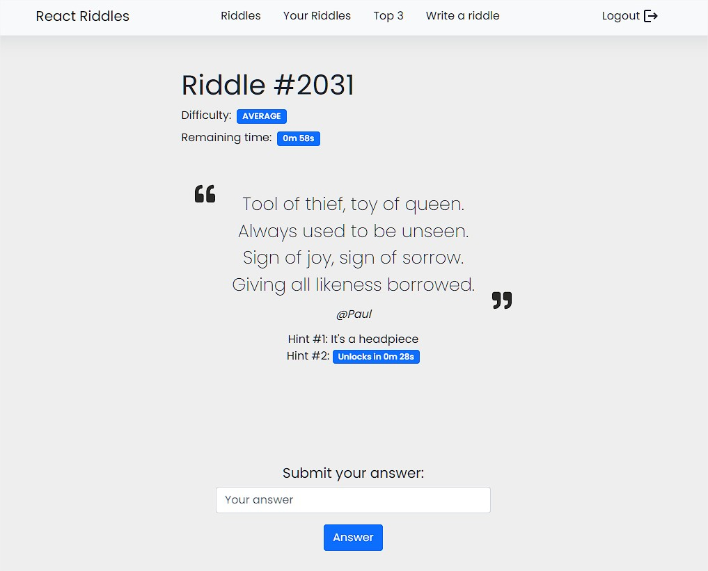

# React Riddles
### Web applications I course project

Challenge yourself by solving riddles posted by users, or submit your own.
- Earn points by solving riddles
- See the list of all riddles, filter them by open/close status
- See the top 3 riddle solvers
- Submit a new riddle, providing hints that will be displayed over time

## Screenshots

### Riddle page


### List of riddles


## Running the application

### Server side
```
  cd server
  npm i
  node index.js
```

### Client side
```
  cd client
  npm i
  npm start
```

# Server Implementation

## HTTP APIs Server

- POST `/api/v1/users/login` - Login
  - Request, no parameters, body: username {string}, password {string}
  - Response, no body content
- DELETE `/api/v1/users/logout` - Logout
  - Request, no parameters, no body content
  - Response, no body content
- GET `/api/v1/users/top3` - Get top 3 scores
  - Request, no parameters, no body content
  - Response, body: array of User objects
- POST `/api/v1/riddles` - Submit a new riddle
  - Request, no parameters, body: question {string}, response {string}, difficulty {string}, duration {number}, firstHint {string}, secondHint {string}
  - Response, body: id {integer} - The id of the newly created riddle
- GET `/api/v1/riddles` - Get all riddles
  - Request, no parameters, no body content
  - Response, body: array of Riddle objects
- GET `/api/v1/riddles/:riddleID` - Get a specific riddle
  - Request, parameters: riddleID {number} the requested riddle, no body content
  - Response, body: the requested Riddle object
- GET `/api/v1/riddles/mine` - Get all riddles of the authenticated user
  - Request, no parameters, no body content
  - Response, body: array of Riddle objects
- POST `/api/v1/riddles/:riddleID/answers` - Submit an answer to a riddle
  - Request, parameters: riddleID {number} the riddle to submit the answer to, body: answer {string}
  - Response, body: correct: {boolean} - Wether the answer was correct or not

## Database Tables

- Table `user` - contains users who post/solve riddles

  - id INTEGER PRIMARY KEY AUTOINCREMENT
  - username VARCHAR(32)
  - points INTEGER CHECK(points >= 0)
  - profile_image VARCHAR(64)
  - hash VARCHAR(128)
  - salt VARCHAR(128)

- Table `riddle` - contains the riddles posted by users

  - id INTEGER PRIMARY KEY AUTOINCREMENT
  - question VARCHAR(500)
  - response VARCHAR(100)
  - first_hint VARCHAR(100)
  - second_hint VARCHAR(100)
  - solution_found BOOLEAN CHECK(solution_found IN (0, 1))
  - duration INTEGER CHECK(duration >= 30 AND duration <= 600)
  - difficulty CHECK( difficulty IN ('easy','average','hard') )
  - created_at DATETIME DEFAULT CURRENT_TIMESTAMP
  - start_time DATETIME NULL
  - user_id INTEGER
  - FOREIGN KEY(user_id) REFERENCES user(id)

- Table `answer` - contains the answers submitted by users to riddles

  - user_id INTEGER
  - riddle_id INTEGER
  - answer VARCHAR(100)
  - winner BOOLEAN
  - created_at DATETIME DEFAULT CURRENT_TIMESTAMP
  - PRIMARY KEY(user_id, riddle_id)
  - FOREIGN KEY(user_id) REFERENCES user(id)
  - FOREIGN KEY(riddle_id) REFERENCES riddle(id)

# Client Implementation

## React Client Application Routes

- Route `/`: List of all riddles
- Route `/mine`: List of all riddles created by logged in user [REQUIRES AUTHENTICATION]
- Route `/top3`: Top 3 scores of riddle solvers
- Route `/new`: Form to submit a new riddle [REQUIRES AUTHENTICATION]
- Route `/riddles/:riddleID`: The riddle (question, hints, user answers) specified by :riddleID parameter
- Route `/login`: Login form
- Route `/*`: 404 page, for any other route

## Main React Components

- `LoginForm` (in `LoginForm/LoginForm.js`): Login form to authenticate a user
- `NotFound` (in `NotFound/NotFound.js`): 404 page, wrong route was used, brings back to riddle page
- `Riddle` (in `Riddle/Riddle.js`): Shows riddle information: question, hints, answer form, user answers
- `RiddleAnswer` (in `Riddle/RiddleAnswer.js`): An answer from a user to a riddle, shows user info and answer
- `RiddleForm` (in `RiddleForm/RiddleForm.js`): Form to submit a new riddle, contains inputs to insert riddle information
- `RiddleList` (in `RiddleList/RiddleList.js`): List of riddles with filters to update which riddles are shown
- `TopThree` (in `TopThree/TopThree.js`): List of top 3 scores, shows user info, points and position in the leaderboard

## Users Credentials

Username, password
- Mark, password
- Paul, password
- Sophie, password
- John, password
- Miriam, password
